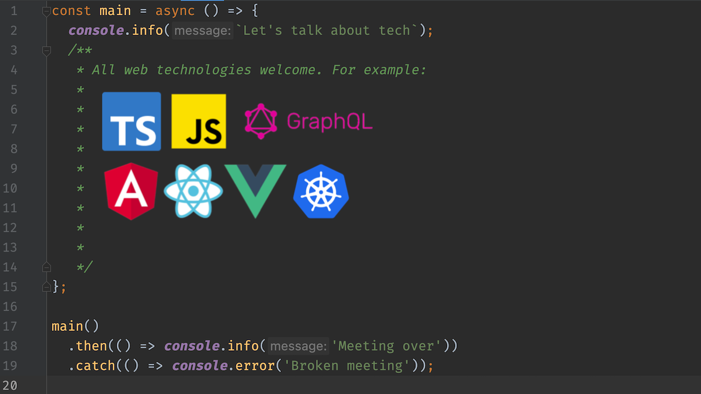

# Meetup: web-dev-coffee-talk
Organizing the web-developer coffee talk in a developer style.

This meetup is all about web-technologies. Example-topics we want to cover in the meetup are:

* Languages
  * javascript
  * typescript
  * php
  * ...
* Framewarks
  * Angular
  * Ionic
  * React
  * Vue.js
  * ...
* APIs
  * REST
  * GraphQL
* DevOps
  * Docker
  * Kubernetes
  * Rancher
  * ...
* nodeJs
* ...

# Topics
We collect topics to discuss in the File TOPICS.md. If you want to contribute, please create a pull-request with the topics you can contribute, or whant to hear more about.

# Content of previous talks
In the directory content we collect the contents of the previous talks. There is also a README.md for further advice.

# Contribute
Feel free to create pull-requests for changes, or create an issue for feedback (:
