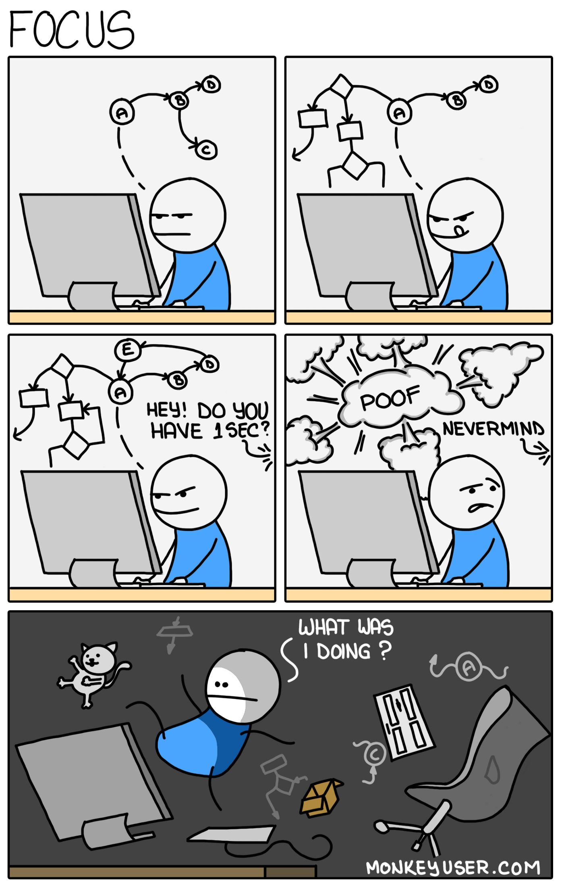

# web-developer coffee table - Ich bin im Tunnel 💈 - Fokus ohne Netzprobleme
> Aaron Bach - tabya GmbH - a.bach@tabya.de

---
layout: center
class: text-center
---

# Let's **DU** it
> Wir "dutzen" uns in diesem Termin, auch wenn das im Alltag sonst nicht der Fall ist

# Let's **eat**!
> Esst gerne während des Termins, es ist Mittagszeit (-: 

---
layout: default
---

# Who is who?
> kurze Vorstellungsrunde
> - Name
> - Was gibt es heute zum Mittagessen?
> - Was ist dein technologischer Fokus?
> - Was machst du in deinem Beruf hauptsächlich?

---
layout: center
class: text-center
---

# Orga
> Inhalt: https://github.com/aaronbach/web-dev-coffee-talk

---
layout: center
---

https://www.monkeyuser.com/2018/focus/

---
layout: center
---

# INIT: Ich bin im Tunnel 💈 - Fokus ohne Netzprobleme
> Warum Fokus?

---
layout: center
---

# Allgemein
>   - Strukturiere deinen Tag, sonst wird er für dich strukturiert
>   - Blocke dir die Zeit in der du am konzentriertesten bist
>   - Meetings:
>     - Meetingfreie Tage
>     - Bringe ich einen Mehrwert für das Meeting, zu dem ich eingeladen wurde?
>     - 2 Füße Regel: Jedes Meeting darf verlassen werden, wenn man merkt, dass man nichts beizutragen hat
>     - 2 Hände Regel: Alle Termine sind öffentlich; Jeder der Lust hat zu partizipieren, meldet sich selbst an
>     - Legt Termine möglichst hintereinander, aber plant 5-10min Pause zwischen den Terminen
>   - Pomodoro - 25min arbeiten / 5min Pause
>     - Auch fürs Pairprogramming gut geeignet
>   - Brich deine Arbeitspakete in möglichst kleine Happen und plane größere Vorgänge vorher durch.
>   - Sei nicht immer erreichbar, aber kommuniziere wann man bei dir mit einer Antwort auf Chatnachrichten rechnen kann
>   - Schalte deine Notifications aus, wenn du in Ruhe arbeiten möchtest
>     - Nutze die Funktionen deiner Geräte um dir Arbeitsprofile zu schaffen
>   - Nutze, dass du deine Arbeitszeit frei einteilen kannst: Mache Feierabend, wenn du mental keinen Fokus/Konzentration findest

---
layout: center
---

# Arbeit strukturieren
> - Cognitive Load senken, indem alle Teamkollegen am gleichen Epic sitzen
>   - Das Daily wird deutlich leichter, da jeder schon im Thema ist
>   - Geplante Roadmap ist der Schlüssel
> - Stop starting, start finishing: WIP (Work in progress) Limits
>   - Nicht zu viele Punkte parallel angehen; Eine Aufgabe nach der anderen
> - Was tun, bei kurzen Pausen für z.B. Deploys
>   - Weiterbilden
>   - Code Reviews
>   - Mach Musik: Keyboard, etc
>   - Achtsamkeits- / Meditationsübung
> - Timeboxe deine Arbeit (siehe Pomodoro)
>   - Wenn du nicht weißt wie lange brauchst, setze dir eine Grenze (Spike)
> - Wenn ich ein Thema noch nicht ganz durchblicke, kann das Problem einem unbeteiligten erklärt werden um dabei selbst einen tieferen Einblick zu erhalten
>   - Siehe: Rubber Duck

---
layout: center
---

# Arbeiten im Büro
>   - Klare Fokuszeiten mit Kopfhörer; Jeder sieht, dass du gerade fokussiert bist
>   - Mache Pausen - Gemeinsame Pausen für sozialen Austausch

---
layout: center
---

# Working remote
> - Zieh dich an, als würdest du ins Büro fahren.
> - Strukturierte Kommunikation ist Key. Steckt klare Regeln für die remote Kommunikation
> - Denke an frische Luft; Mache einen Spaziergang / Lüften
>   - Ein HundHaustier
> - Coworkingspaces bieten die Möglichkeit Soziale Kontakt zu knüpfen
> - Urlaub und Arbeit lassen sich in der IT-Branche verknüpfen um frische Gedanken zu erhalten
> - Sozialen Austausch verbessern:
>   - Offene Channels in Slack
>   - Viedeochat starten und den Link für alle teilen

---
layout: center
---

# Feedback
> Offenes / konstruktives Feedback

> Gerne an a.bach@tabya.de
