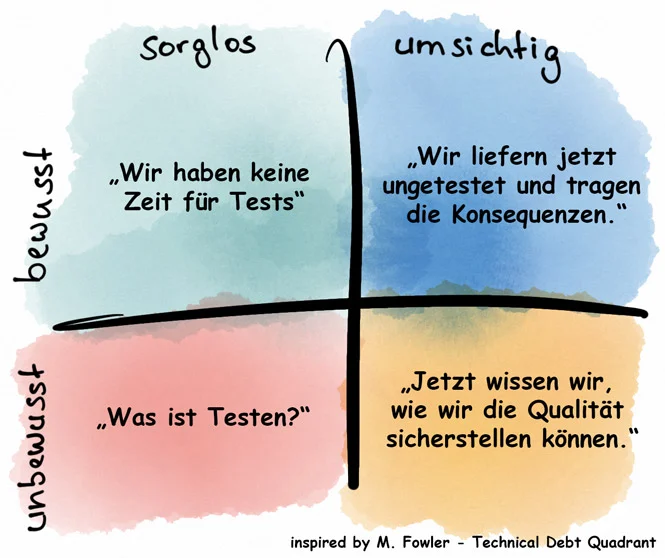

# &shy;
# &shy;
> Aaron Bach - tabya GmbH - a.bach@tabya.de

---
layout: center
class: text-center
---

# Let's **DU** it
> Wir "dutzen" uns in diesem Termin, auch wenn das im Alltag sonst nicht der Fall ist

# Let's **eat**!
> Esst gerne während des Termins, es ist Mittagszeit (-:

---
layout: default
---

# Who is who?
> kurze Vorstellungsrunde
> - Wie lautet dein Name?
> - Wie machst du beruflich?

---
layout: center
class: text-center
---

# Orga
> Inhalt: https://github.com/aaronbach/web-dev-coffee-talk

---
layout: default
---

# Was ist technische Schuld?
> * Metapher für die möglichen Konsequenzen schlechter technischer Umsetzung von Software
> * Aufschieben von Maßnahmen zur Sicherung und Erhöhung technischer Qualität
> * beschleunigen Entwicklung nicht, sondern verlangsamen sie

---
layout: center
class: text-center
---

> https://blogs.itemis.com/technische-und-organisatorische-schulden-erkennen

---
layout: center
class: text-center
---

# Beispiele technischer Schuld
* Aufschieben oder Nicht-Aktualisierung technischer und fachlicher Softwaredokumentation
* Fehlende technische Infrastruktur wie Versionsverwaltung, Datensicherung, Build-Tools, Kontinuierliche Integration
* Aufschieben, Verzicht oder ungenügende Umsetzung automatisierter Modultests und Regressionstests
* Fehlende Coding Standards und Code Ownership
* Missachtung von TODO- oder FIXME- oder XXX-Hinweisen im Code
* Missachtung von Codewiederholungen und anderen Code-Smells
* Verwendung von Programmierungs-Anti-Pattern
* Missachtung von Compiler-Warnungen und Ergebnissen statischer Code-Analyse
* Versäumen der Korrektur von zu großem oder zu komplexen Code und Design
* Fehlerhafte Definition oder Umsetzung der Architektur durch enge Kopplung, Zirkelbezug der Komponenten oder das Fehlen geeigneter Schnittstellen und Fassaden

---
layout: center
---

# Was kann gegen technische Schulden unternommen werden?
> * Mindset für technische Schulden schaffen
> * Sicherstellung von Code Qualität
>   * Einhaltung von Clean Code Prinzipien (z.B. DRY / KISS)
>   * Verhindern von Antipattern
>   * Statische Code Analyse (Z.B. Sonarqube)
> * Bewusstes einplanen von technischer Schuld in der täglichen Entwicklung
> * Gegenseitige CodeReviews
> * Pairprogramming

---
layout: center
---

# Sind alle meine Probleme gelöst, wenn keine technischen Schulden mehr existieren?
> Nein! Genauso wichtig wie technische Schulden sind organisatorische Schulden
> * Prozesse
> * Kommunikation

---
layout: center
---

# Feedback
> Offenes / konstruktives Feedback

> Gerne an j.heilmann@tabya.de / a.bach@tabya.de
